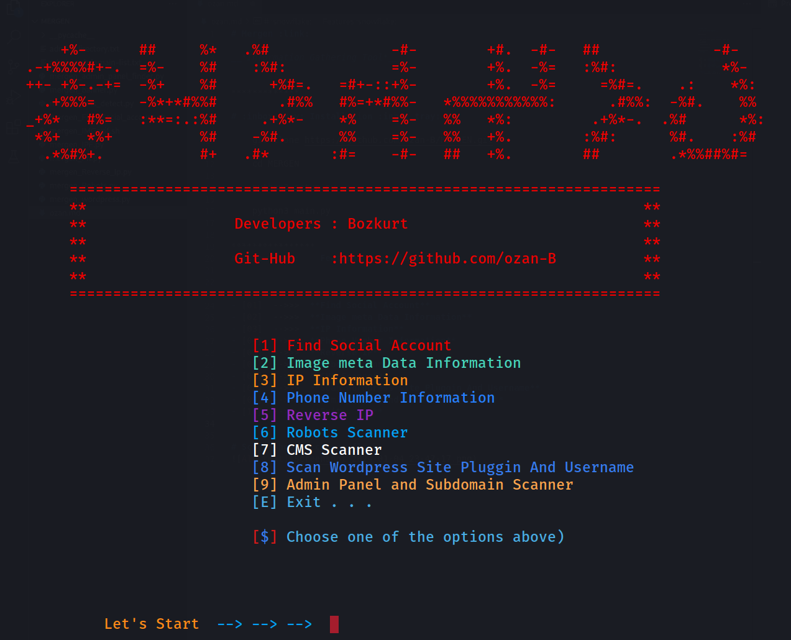

# Mergen :link:	

__*Information Gathering Tool*__

*************

# :inbox_tray: Installation :inbox_tray:

    git clone https://github.com/ozan-B/Mergen.git

    cd Mergen

    python3 setup.py

    python3 main.py

****************
# :snowflake:	 Features :snowflake:	

- [01]  -->>>  **Find Social Account**
- [02]  -->>>  **Image meta Data Information**
- [03]  -->>>  **IP Information**
- [04]  -->>>  **Phone Number Information**
- [05]  -->>>  **Reverse IP**
- [06]  -->>>  **Robots Scanner**
- [07]  -->>>  **CMS Scanner**
- [08]  -->>>  **Scan Wordpress Site Pluggin And Username**
- [09]  -->>>  **Admin Panel and Subdomain Scanner**
- [E]  -->>>  **Exit . . .**
********

# :camera_flash:Screenshot   :camera_flash:

*********

# :pencil: Description :pencil:

## **1. Find Social Account** :   
* *Girilen kullanıcı adı  için tüm sosyal medya hesaplarını tarar*

## **2.Image meta Data Information** :   

*  *Dosya yolu verilen görüntü dosyasının meta-data bilgilerini ekrana yazdırır .*

## **3.IP Information** : 
*   *Girilen IP hakkında toplanan bilgileri kullanıcıya sunar .*

## **4.Phone Number Information** :
*   *Girilen telefon numarası hakkında toplanan bilgileri kullanıcıya sunar .* 

## **5.Reverse IP** :    
*  *Girilen domain hakkında reverse Ip taraması yapar .*

## **6.Robots Scanner** : 
*   *Girilen Web sitesi adresi için robots taraması yapar .*

## **7.CMS Scanner** :  

*  *Web sitesinin hangi CMS'yi kullandığını kullanıcıya sunar .*

## **8.Scan Wordpress Site Pluggin And Username** :   

*   *Girilen web sitesi adresi için önce WordPress olup olmadığını kontrol eder , daha sonra kullanıcının seçimine göre plugin taraması veya username taraması yapar .*

## **9.Admin Panel and Subdomain Scanner** :     
*   *Girilen web sitesi adresi için admin Panel veya alt dizin taraması yapar .*

